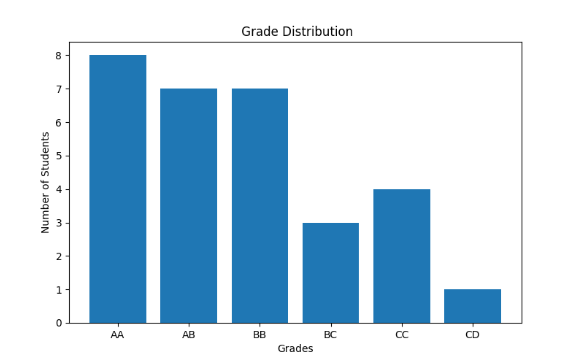
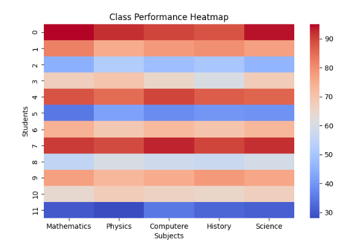
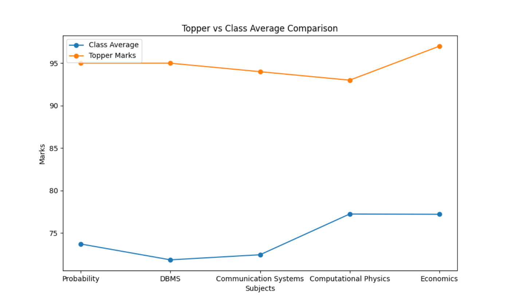
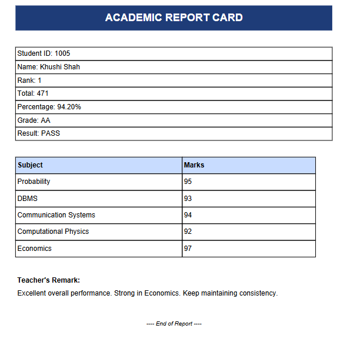

# 🎓 Student Marks Analyser

A Python-based Academic Result Processing and Analytics System that automates student evaluation, generates professional PDF report cards, and provides advanced subject-level performance insights using statistical and graphical analysis.

---

## 📌 Overview

The **Student Marks Analyser** is a comprehensive academic evaluation system that:

- Accepts structured student marks input
- Validates data integrity
- Computes grades and rankings
- Generates detailed PDF report cards
- Performs subject-wise statistical analysis
- Produces graphical performance insights
- Identifies academic competition gaps

This system goes beyond simple result generation and provides meaningful academic analytics useful for institutional decision-making.

---

## 🚀 Features

### ✅ Core Functionalities
- Student data validation (ID, name, marks constraints)
- Grade calculation
- Percentage and total computation
- Class ranking system
- Pass / Fail categorization
- Subject-wise Top 10 lists
- Class statistics report generation

### 📊 Graphical Analytics
- 📈 Grade Distribution (Bar Chart)
- 🔥 Heatmap for Subject Performance
- 🏆 Topper vs Class Average Competition Analysis

### 📄 Professional Reports
- Individual PDF report cards
- Dynamic subject-wise remarks
- Strongest & weakest subject detection
- Heatmap Analysis PDF
- Topper vs Average Gap Analysis Report

---

## 🧠 Academic Insights Provided

The system automatically identifies:

- Most difficult subject
- Most balanced subject
- Subject competition gap
- Class average vs topper disparity
- Performance distribution trends
- Grade distribution spread

This makes the system useful for:

- Academic audits
- Performance evaluation
- Institutional reporting
- Educational analytics

---

## 🛠 Technologies Used

- **Python**
- `os`
- `pandas`
- `matplotlib`
- `seaborn`
- `reportlab`


---

## 📂 Project Structure
```bash
STUDENT_MARKS_ANALYSER/
│
├── main.py
│ 
├── TEXT FILES/
│   └── (generated outputs)
│
├── screenshots/
│   ├── grade_distribution.png
│   ├── heatmap.png
│   ├── topper_vs_average.png
│   ├── report_card_average.png
│   ├── report_card_topper.png
│   └── report_card_fail.png
├── requirements.txt
├── README.md
└── .gitignore
```
## 🖼 Sample Outputs

### 📈 Grade Distribution


---

### 🔥 Heatmap Analysis


---

### 🏆 Topper vs Class Average


---

### 📄 Sample Report Card


---

## ▶ How to Run

### 1️⃣ Clone the Repository

```bash
git clone https://github.com/khushishahs02/student-marks-analyser.git 
```

### 2️⃣ Install Dependencies
```bash
pip install -r requirements.txt
```
### 3️⃣ Navigate to the Project Folder
```bash
cd STUDENT_MARKS_ANALYSER/
```
### 4️⃣ Run the Program
```bash
python main.py
```
---

## 👩‍💻 Author

**Khushi Shah**   

This project was developed as part of an academic mini project to demonstrate practical implementation of:

- File handling in Python  
- Data validation and processing  
- Statistical analysis  
- Data visualization  
- Automated PDF report generation  

### 🧠 Learning Approach

This project began as an exploration of Python’s `os` module and file handling concepts.  
While implementing directory management and automated file generation, the project gradually expanded into a complete academic analytics system.

During development, I used AI tools (such as ChatGPT) as a learning assistant for brainstorming ideas, understanding library usage, and refining implementation strategies.  

However, the overall system design, architecture decisions, integration of multiple libraries, and project structure were independently implemented and iteratively improved as part of my learning process.

What started as an experiment with the `os` library evolved into a full-featured analytics and reporting system because the process of extending functionality and integrating new libraries became an exciting learning journey.

---